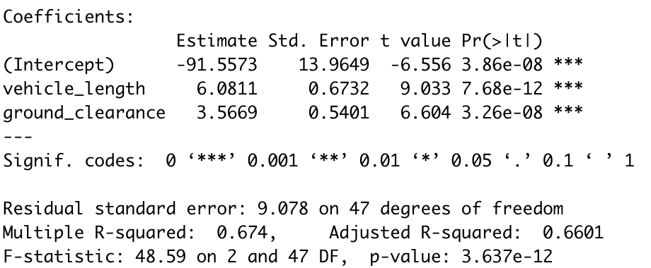
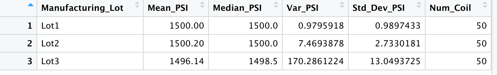
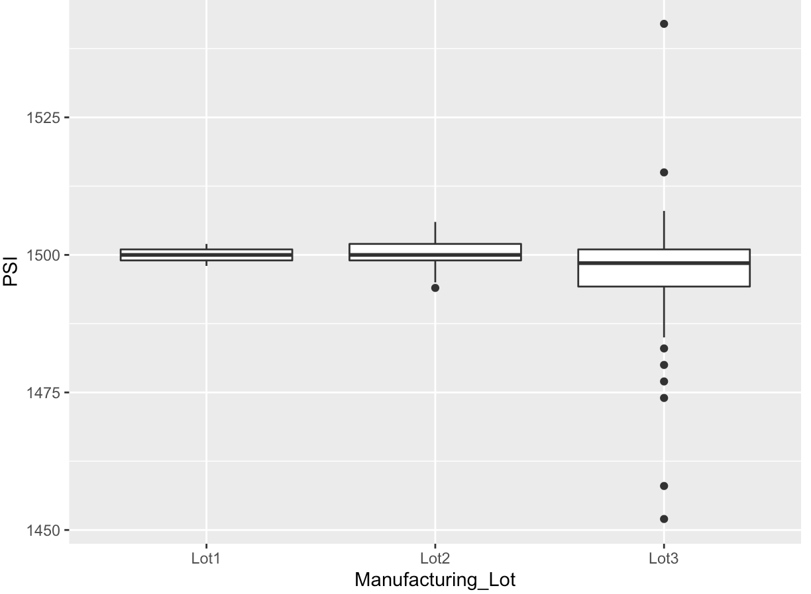
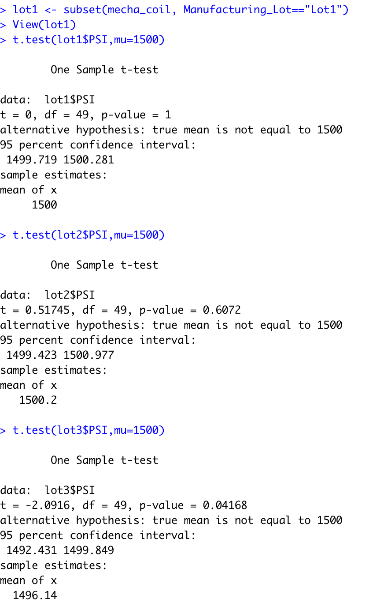

# MechaCar_Statistical_Analysis

## Overview

A few weeks after starting his new role, Jeremy is approached by upper management about a special project. AutosRUs’ newest prototype, the MechaCar, is suffering from production troubles that are blocking the manufacturing team’s progress. AutosRUs’ upper management has called on Jeremy and the data analytics team to review the production data for insights that may help the manufacturing team

In this challenge, you’ll help Jeremy and the data analytics team do the following:

Perform multiple linear regression analysis to identify which variables in the dataset predict the mpg of MechaCar prototypes
Collect summary statistics on the pounds per square inch (PSI) of the suspension coils from the manufacturing lots
Run t-tests to determine if the manufacturing lots are statistically different from the mean population
Design a statistical study to compare vehicle performance of the MechaCar vehicles against vehicles from other manufacturers. For each statistical analysis, you’ll write a summary interpretation of the findings.

This new assignment consists of three technical analysis deliverables and a proposal for further statistical study. You’ll submit the following:

Deliverable 1: Linear Regression to Predict MPG
Deliverable 2: Summary Statistics on Suspension Coils
Deliverable 3: T-Test on Suspension Coils
Deliverable 4: Design a Study Comparing the MechaCar to the Competition

## Deliverable 1:

### Linear Regression to Predict MPG 

The MechaCar_mpg.csv dataset contains mpg test results for 50 prototype MechaCars. The MechaCar prototypes were produced using multiple design specifications to identify ideal vehicle performance. Multiple metrics, such as vehicle length, vehicle weight, spoiler angle, drivetrain, and ground clearance, were collected for each vehicle. Using your knowledge of R, you’ll design a linear model that predicts the mpg of MechaCar prototypes using several variables from the MechaCar_mpg.csv file. 

Results:

_results.png)

From the above output we can infer the following:

1. The vehicle_length & the ground_clearance are likely to provide non-random amounts of variance to the model. Thus, they have a significant impact on the miles per gallon on the MechaCar protoype. Whereas, the vehicle_weight, spoiler_angle and the AWD have p-values that indicate a random amount of variance with the dataset.

2. From the Linear model we notice that the p-Value has a value of 5.35e-11 which is much smaller than the assumed significance level of 0.05%. Thus, this is sufficient evidence to reject our null hypothesis, which further shows us that the slope of this linear model is not zero.

3. This linear model predicts mpg of MechaCar prototypes effectively. The r-squared value of 0.7149 means that approximately 71% of all mpg predictions will be determined by this model.

Note: If we remove the less impactful independent variables (vehicle weight, spoiler angle & All Wheel Drive) the predictability does decreases by 0.674, but not significantly.

## Deliverable 2:
### Create Visualizations for the Trip Analysis

The MechaCar Suspension_Coil.csv dataset contains the results from multiple production lots. In this dataset, the weight capacities of multiple suspension coils were tested to determine if the manufacturing process is consistent across production lots. Using your knowledge of R, you’ll create a summary statistics table to show:

The suspension coil’s PSI continuous variable across all manufacturing lots
The following PSI metrics for each lot: mean, median, variance, and standard deviation.

Technical Analysis

1. Download the Suspension_Coil.csv file, and place it in the active directory for your R session.
2. In your MechaCarChallenge.RScript, import and read in the Suspension_Coil.csv file as a table.
3. Write an RScript that creates a total_summary dataframe using the summarize() function to get the mean, median, variance, and standard deviation of the suspension coil’s PSI column.

Thus, the total_summar dataframe is:

The lot_summary dataframe obtained looks like this:

### Summary Statistics on Suspension Coils

Results for all the manufacturing lots:

Results for the 3 lots:

When we look at the results of manufacturing lots we can see that the PSI is 62.29, which is within the 100PSI variance requirement.

Now, when we look at he results for the lot1 & lot2 the PSI values are 0.979 & 7.469 which are well within the variance requirement. However, the lot3 shows us a much higher PSI value of 170.286. Thus, we can say that the lot3 is causing the variance at the full lot level.

The below boxplot shows us the difference between the lots:

## Deliverable 3:
### T-Tests on Suspension Coils

Using your knowledge of R, perform t-tests to determine if all manufacturing lots and each lot individually are statistically different from the population mean of 1,500 pounds per square inch.

#### Technical Analysis

1. In your MechaCarChallenge.RScript, write an RScript using the t.test() function to determine if the PSI across all manufacturing lots is statistically different from the population mean of 1,500 pounds per square inch.
2. Next, write three more RScripts in your MechaCarChallenge.RScript using the t.test() function and its subset() argument to determine if the PSI for each manufacturing lot is statistically different from the population mean of 1,500 pounds per square inch.

### Results:

 After performing the t-test on the suspension coil data we can see that the p-value of 0.06028 which is higher that the common significance level of 0.05, thus there is not enough evidence to support rejecting the null hypothesis. We also observed that the true mean of the sample is 1498.89 which we also saw in the summary above. Thus says that the mean of all the three if these manufacturing lots are similar to the presumes population mean of 1500.

Individual lots t-test results:

Comparing each manufacturing lot against mean PSI of the population we observed that:
1. lot1 sample we can see that it has the true sample mean of 1500. With a p-value of 1 clearly means that we cannot reject the null hypothesis & that there us no qualitative difference between the observed sample mean & the presumed population mean that is 1500.

2. lot2 has a outcome with a sample mean of 1500.02 & a p-Value of 0.61, thus, the null hypothesis cannot be rejected & also the sample mean & the presumed population mean are statistically similar.

3. Lot3 has a sample mean of 1496.14 & the p-Value of 0.04, which is lower than the common significance level of 0.05. Which all indicates to reject the null hypothesis.

Thus we can conclude that something went wrong in the lot3's production cycle. This particular lot needs to be checked out for failed suspension coils, etc. 

## Deliverable 4:
### Design a Study Comparing the MechaCar to the Competition
 Using your knowledge of R, design a statistical study to compare performance of the MechaCar vehicles against performance of vehicles from other manufacturers.

This study design has the objective of comparing the performance of MechCar against vehicles from other manufacturers. The potential metrics that consumers could find interesting in this study might include cost, city, or highway fuel efficiency, horse power, maintenance cost, or safety rating. 

To the address the following questions for this deliverable:
1. What metric or metrics are you going to test?
- After carefully consideration about which metrics would be of interest to a consume, I have decided to test the following metrics in my statistical study: cost, city & highway fuel efficiency, and horsepower. I can test how MechCars are priced to their competition with the fuel efficiency & horsepower.

2. What is null hypothesis & alternative hypothesis?
- Null Hypothesis: There is no difference in fuel efficiency or horsepower in comparison to competitors
- Alternate Hypothesis: They have a difference in the fuel efficiency & horse power in comparison to competitors

3. What statistical test would you use to test the hypothesis? And why?
- I would use the two sample t-test to compare the means from the two populations. And use the boxplot for better understanding & visualization of the results.

4. What data is needed to run the statistical test?
- To carry out this statistical test we will require a collection of data from MechCar & its competitors or the means of both samples, the standard deviation of both samples & the fuel efficiency per class from each competitor.

